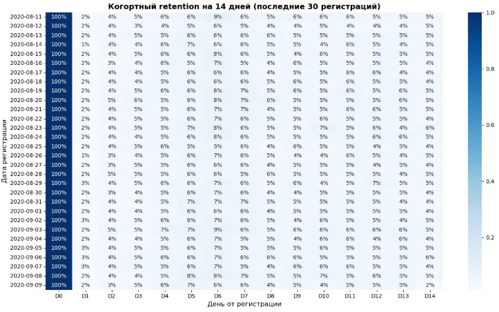

# 📱 Проект 1 — Retention анализа мобильной F2P-игры

## Контекст
Проект посвящён исследованию поведения игроков мобильной F2P-игры (free-to-play). Основная цель — понять, как пользователи удерживаются в продукте после регистрации, и какие факторы влияют на снижение вовлечённости со временем.

## 🎯 Цель проекта
Рассчитать когортный retention игроков, выявить закономерности в удержании пользователей, определить узкие места в воронке и подготовить рекомендации для повышения лояльности и вовлечённости.

## 🛠️ Стек
**Python**: pandas, numpy, matplotlib, seaborn, scipy  
**Инструменты**: Jupyter Notebook

## 🔍 Этапы работы
- Изучение структуры данных и подготовка к анализу
- Расчёт количества уникальных пользователей по когортам регистрации
- Определение метрик удержания (Day-1, Day-7, Day-14, Day-30)
- Построение когортной retention-матрицы и визуализация результатов
- Анализ динамики вовлечённости игроков
- Формулировка гипотез и рекомендаций по улучшению удержания

## ✅ Результаты

### 📊 Retention
- Рассчитан когортный retention на 14 дней.
- Средний D7 retention: **~6–7%**.
- Ниже — тепловая карта удержания:

---

### 🧪 A/B-тест акционных предложений
**Ключевые метрики:**
- CR (доля платящих)
- ARPU (средняя выручка на пользователя)
- ARPPU (средняя выручка на платящего)

**Итоги по группам:**
- Группа A (контроль): CR = **0.95%**, ARPU = **25.41**, ARPPU = **2664.00**
- Группа B (тест): CR = **0.89%**, ARPU = **26.75**, ARPPU = **3003.66**

**Статистическая проверка:**
- Разница CR (B−A): **−0.06 п.п.**; Z-тест p-value = 0.035 → значимо на 5% уровне.
- Разница ARPU (B−A): **+1.34**; 95% CI Welch [−2.87; 5.54] → различия **не подтверждены**.
- Разница ARPPU (B−A): **+339.66**; 95% CI Welch [−65.38; 744.70].

**Бизнес-интерпретация:**
- Uplift: ARPU +5.26%, CR −6.64%, ARPPU +12.75%.

**Рекомендации:**
- Результат по ARPU неубедителен → повторить эксперимент или доработать офферы.
- Провести сегментный анализ (канал, гео, когорты, платёжная история).
- Протестировать вариации прайсинга и пакетов для удержания CR при росте ARPPU.

---

### 📑 Итоговая таблица
| Группа | Пользователей | Платящих | Выручка  | CR     | ARPU   | ARPPU  |
|--------|---------------|----------|----------|--------|--------|--------|
| A      | 202,103       | 1,928    | 5,136,189| 0.95%  | 25.41  | 2664.00|
| B      | 202,667       | 1,805    | 5,421,603| 0.89%  | 26.75  | 3003.66|
